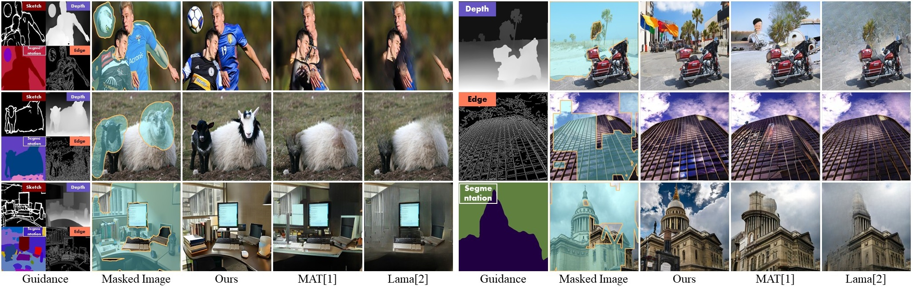

# MaGIC

🔮 This is the official code and model release for **MaGIC: Multi-modality Guided Image Completion**. In submission.

[[`Website`](http://www.yongshengyu.com/MaGIC-Page/)] [[`Paper`](https://arxiv.org/abs/2305.11818)] [[`BibTex`](#citing-magic)]


## Requirements

🔧 Installing both PyTorch and TorchVision with CUDA support is strongly recommended. The code requires python>=3.8, as well as pytorch>=1.10 and torchvision>=0.11. 

A suitable conda environment named `magic` can be created and activated with:

```bash
conda create -n magic python=3.8.5
pip install -r requirements.txt
conda activate magic
```

**Attention:** If the compute capability of your GPU is greater than 7.0, such as GeForce RTX 3090, you need to comment out `torch==1.10.1 torchvision==0.11.2` and uncomment `--extra-index-url https://download.pytorch.org/whl/cu113 torch==1.12.1+cu113 torchvision==0.13.1+cu113` in **requirements.txt** before running `pip install -r requirements.txt`.

Prepare example images and model weights as follows,

|         Files          |              Google Drive / HF                                                                       |                     Baidu Pan                                            |
|-----------------------------|-------------------------------------------------------------------------------------------------------|----------------------------------------------------------|
| Backbone(SD-inpainting-2.1) | [Huggingface](https://huggingface.co/stabilityai/stable-diffusion-2-inpainting/resolve/main/512-inpainting-ema.ckpt) | [Baidu Pan](https://pan.baidu.com/s/1XVM2JHO-G2Vo9pHSwKKhbg?pwd=g0zh) |
| MaGIC checkpoints  and example images        |      [Google Drive](https://drive.google.com/drive/folders/11ymFCrm5thvdW0tJv_O7iz5Ba1RG2-B4?usp=sharing)    | [Baidu Pan](https://pan.baidu.com/s/1XVM2JHO-G2Vo9pHSwKKhbg?pwd=g0zh) |

## Get Started

1. 🔑 First, download model checkpoints and place them in the `checkpoints/` folder.

2. ✏️ Then, check the inference config in `configs/example_config.yaml`. Edit it according to your personal settings, such as input images and masks.

3. 🏃 Run the following command to get the completed image result:
```bash
python infer.py
```



## Code Description

### Structure
We explain each folder in the root directory as follows:

- Folder `annotator`: contains guidance modality-related processing
- Folders `checkpoints` and `examples`: include pre-trained weights, COCO image captions, and example test images. Please download them directly.
- Folder `ldm`: contains stable diffusion code, our CMB (consistent modality blending) as in `ldm/models/diffusion/ddim_infer.py`
- Folder `modules`: consists of condition networks and inference utils
- Folder `scripts`: includes script files that may be useful.

### Hand-crafted Mask Generation

🎭 We provide a gradio GUI to generate masks for input images.

You can simply run `python scripts/draw_mask.py` and open the webpage using a local URL. Click the

 *Save* button to save the pair of image and mask map to the `scripts/pair/` folder.


### Evaluation Script

📊 We provide an evaluation script used in the paper, found in the file `scripts/evaluate.py`. 
To get your score, please edit the variables `folder1` and `folder2`, and follow these tips:
1. Enable `is_pick` to calculate PickScore. If the test image has no captions/prompt text, please set `is_pick` to `False`.
2. If the number of test images is too small, resulting in a zero P/U-IDS score, augment the test dataset to address the issue.
3. To calculate the standard deviation, enable `cal_std`. If not provide multiple results, please set `cal_std` to `False`.

Evaluation output examples:
```
> folder1: results/lama_coco/
fid: 48.6322, pids: 0.0000, uids: 0.0000, pickscore: 0.2906 
fid_std: 0.0000, pid_std: 0.0000, uid_std: 0.0000, pick_std: 0.0000 
> folder1: results/lama_places/
fid: 13.6287, pids: 0.1054, uids: 0.2284, pickscore: -1.0000 
fid_std: 0.0000, pid_std: 0.0000, uid_std: 0.0000, pick_std: 0.0000 
```


## TODO

📝 The workload is not small, so things will not progress very quickly. 

- [x] Release inference code and structure-form tau-net checkpoints
- [ ] Release Gradio Demos
- [ ] Release local edit code (+SAM)
- [ ] Release context-form tau-net code
- [ ] Release image generation code and related checkpoints
- [ ] Release tau-net train code


## Citing MaGIC
If you find this repository useful, please consider giving it a star :star: and citing it:

```
@article{yu2023magic,
      title={MaGIC: Multi-modality Guided Image Completion},
      author={Yu, Yongsheng and Wang, Hao and Luo, Tiejian and Fan, Heng and Zhang, Libo},
      journal={arXiv preprint arXiv:2305.11818},
      year={2023}
}
```

## Acknowledgment

We would like to thank the authors of [LDM](https://github.com/CompVis/latent-diffusion) and [T2I-adapter](https://github.com/TencentARC/T2I-Adapter) for sharing their codes.